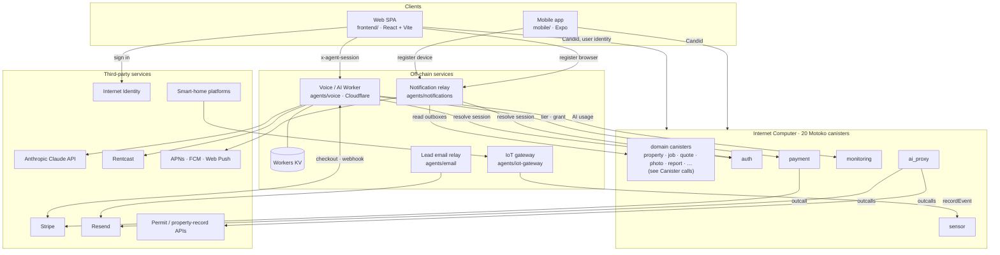
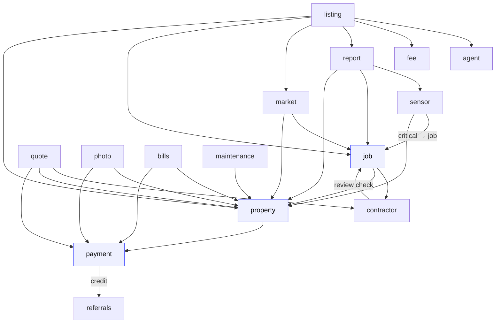

# HomeGentic — Architecture

HomeGentic is a **home maintenance intelligence platform** built entirely on the
Internet Computer Protocol (ICP). Every record — job, photo hash, score,
report, quote — lives as stable on-chain state inside Motoko canisters.
No traditional database. No centralized server. No single point of failure.

---

## The Big Picture

```
┌─────────────────────────────────────────────────────────────────────────┐
│                         Browser (SPA)                                   │
│                                                                         │
│   React + TypeScript · Vite · Zustand · inline styles (no CSS framework)│
│                                                                         │
│   Public pages         │  Authenticated pages    │  Shared chrome       │
│   /  /pricing          │  /dashboard (v3 rail)   │  Layout (top bar +   │
│   /for-pros            │  /properties/:id        │    chip rail)        │
│   /check               │  /jobs  /contractors    │  Ask bar (voice)     │
│   /home-systems        │  /maintenance  /market  │  Toasts / modals     │
│   /prices              │  /quotes/:id            │                      │
│   /instant-forecast    │  /settings  /people     │                      │
│   /truth-kit           │  /sensors  /warranties  │                      │
│   /report/:token       │  /recurring/:id         │                      │
│   /cert/:token         │  /listing/:id           │                      │
│   /homes               │  /agents/* (realtors)   │                      │
└────────────┬───────────┴──────────┬──────────────┴──────────────────────┘
             │                      │
             │ @dfinity/agent       │ fetch (mocked when no canister)
             │ (Candid RPC)         │
             ▼                      ▼
┌────────────────────┐   ┌──────────────────────────────────────────────┐
│   ICP Local/Main   │   │   Voice / AI proxy — Cloudflare Worker        │
│     network        │   │   (agents/voice/src/index.ts; :8787 locally)  │
│                    │   │                                              │
│  20 Motoko         │   │  POST /api/agent   ── agentic tool-use loop  │
│  canisters         │   │  POST /api/chat    ── SSE streaming chat     │
│  (see below)       │   │  POST /api/extract-document, /api/pulse, …   │
│                    │   │  POST /api/stripe/*  ── checkout + webhook   │
└────────────────────┘   │                                              │
                         │  Calls: Claude API (Anthropic), Stripe, ICP  │
                         └──────────────────────────────────────────────┘
```

Public free tools (price benchmarks, year-built lookup, instant forecast,
buyer report check) call the `ai_proxy` canister directly rather than the
Worker.

---

## System Diagram

GitHub renders these Mermaid diagrams inline. They are drawn from the code:
off-chain edges from the services' canister clients and outbound URLs, and
canister edges from the `actor(...)` cross-calls in each `backend/*/main.mo`.
If you add a cross-canister call or an external integration, update them.

### Components



The voice Worker never holds the user's identity. The browser gets a
24-hour session token from `auth.issueAgentSession`, and the Worker resolves
it back to a principal with `auth.resolveAgentSession`. Agent tool calls run
in the browser against the canisters with the user's own identity (see
[Voice Agent](#voice-agent)).

### Canister calls

Each arrow is a canister-to-canister call (`caller --> callee`). Wiring is set
after deploy with each canister's `set<Name>CanisterId` admin method; an
unwired call is skipped. Some callees also accept certain update calls only
from their wired caller: `agent` and `fee` from `listing`, `contractor`
from `job`, `referrals` from `payment`.



`property`, `payment` and `job` (highlighted) are the hubs: most canisters
read ownership from `property` and limits from the caller's tier in
`payment`.

Left out to keep the graph readable:

- **`audit`**: `auth`, `payment`, `photo`, `property` and `report` send it
  fire-and-forget log entries for admin actions.
- **`monitoring`**: reads product metrics from `property`, `job`, `quote`
  and `payment`.
- `recurring` and `ai_proxy` make no canister calls.

---

## Canister Map

All 20 canisters use `persistent actor` (Motoko mo:core) — all variables
are implicitly stable, so no `preupgrade`/`postupgrade` hooks are needed.
`transient var` is used for in-memory structures that should reset on upgrade
(e.g. rate-limit sliding-window maps). Each canister exports `metrics()`,
`pause()`, and `unpause()` for operational control.

```
┌──────────────────┬─────────────────────────────────────────────────────────┐
│ Canister         │ What it owns                                            │
├──────────────────┼─────────────────────────────────────────────────────────┤
│ auth             │ User profiles, roles (Homeowner / Contractor / Realtor /│
│                  │ Builder)                                                │
│                  │ Internet Identity principal mapping                     │
├──────────────────┼─────────────────────────────────────────────────────────┤
│ property         │ Property registration & ownership verification          │
│                  │ Verification pipeline: Unverified → PendingReview →     │
│                  │   Basic → Premium; 7-day conflict window                │
│                  │ Room / fixture CRUD (merged from former room canister)  │
├──────────────────┼─────────────────────────────────────────────────────────┤
│ job              │ Maintenance records with dual-signature verification:   │
│                  │   homeowner + contractor, or DIY homeowner-only         │
│                  │ Immutable once both parties have signed                 │
├──────────────────┼─────────────────────────────────────────────────────────┤
│ contractor       │ Contractor profiles, trust scores                       │
│                  │ Rate-limited reviews (10/day/user, composite-key dedup) │
├──────────────────┼─────────────────────────────────────────────────────────┤
│ quote            │ Quote requests & contractor bids                        │
│                  │ Tier-enforced open-request limits                       │
│                  │ Sealed bids (vetKD identity-based encryption)           │
├──────────────────┼─────────────────────────────────────────────────────────┤
│ payment          │ Subscription tier management & expiry                   │
│                  │ Pricing table queries: getPricing(tier) / getAllPricing()│
│                  │   (merged from former price canister)                   │
├──────────────────┼─────────────────────────────────────────────────────────┤
│ photo            │ Photo bytes stored on-chain; SHA-256 deduplication      │
│                  │ Tier-based upload quotas                                │
│                  │ Multi-approval workflow for sensitive records           │
├──────────────────┼─────────────────────────────────────────────────────────┤
│ report           │ Immutable report snapshots (point-in-time score + jobs) │
│                  │ Share links with visibility levels & revocation         │
├──────────────────┼─────────────────────────────────────────────────────────┤
│ market           │ ROI-ranked project recommendations                      │
│                  │   (sourced from 2024 Remodeling Magazine cost data)     │
│                  │ HomeGentic score; returned vetKD-encrypted to the owner │
├──────────────────┼─────────────────────────────────────────────────────────┤
│ maintenance      │ Predictive scheduling engine                            │
│                  │ System lifespan estimates, seasonal task generation     │
├──────────────────┼─────────────────────────────────────────────────────────┤
│ sensor           │ IoT device registry (12 device types: Nest, Ecobee,     │
│                  │ Moen Flo, Ring Alarm, Honeywell Home, Rheem EcoNet,     │
│                  │ Sense, Emporia Vue, Rachio, SmartThings, Home Assistant,│
│                  │ Manual). Auto-creates pending jobs for Critical events.  │
├──────────────────┼─────────────────────────────────────────────────────────┤
│ monitoring       │ Cycles usage, cost metrics                              │
│                  │ Profitability signals: ARPU / LTV / CAC; alerting      │
├──────────────────┼─────────────────────────────────────────────────────────┤
│ listing          │ FSBO listing lifecycle, sealed-bid offers, agent match  │
├──────────────────┼─────────────────────────────────────────────────────────┤
│ agent            │ Realtor profiles, reviews, HomeGentic transaction count    │
├──────────────────┼─────────────────────────────────────────────────────────┤
│ recurring        │ Recurring service contracts (HVAC, pest, landscaping)  │
│                  │ Visit logs per contract                                 │
├──────────────────┼─────────────────────────────────────────────────────────┤
│ bills            │ Utility bill records per property (Electric, Gas, Water,│
│                  │ Internet, Telecom). 3-month rolling anomaly detection    │
│                  │ flags bills > 20% above baseline. Anomaly events surface│
│                  │ in the Activity feed bell drawer.                        │
├──────────────────┼─────────────────────────────────────────────────────────┤
│ ai_proxy         │ IC HTTP outcalls: permit imports (ArcGIS / OpenPermit), │
│                  │ property-record lookups, price benchmarks, instant      │
│                  │ forecast, and transactional email via Resend            │
│                  │ (key set on-chain with `setResendApiKey`).              │
├──────────────────┼─────────────────────────────────────────────────────────┤
│ fee              │ Bid to List platform-fee ledger: Owed → Invoiced →      │
│                  │ Paid / Waived. Identities are released only after the   │
│                  │ fee settles (charge, then release).                     │
├──────────────────┼─────────────────────────────────────────────────────────┤
│ referrals        │ Referral codes (HG-000001) and $10 credits for both     │
│                  │ sides after the referee's first paid month              │
├──────────────────┼─────────────────────────────────────────────────────────┤
│ audit            │ Append-only log of privileged (admin) actions; written  │
│                  │ fire-and-forget by the other canisters, admin-read only │
└──────────────────┴─────────────────────────────────────────────────────────┘
```

---

## Subscription Tiers

Enforced server-side inside `payment`, `quote`, `photo`, and `property`.
The frontend reflects tier state but never gates logic unilaterally.

There are two homeowner tiers: **Free** and **Pro at $59/year**. A user
with no subscription record is Free. Free is not fully blocked: it gets
1 property, 5 photos/job and 3 open quote requests, plus job logging, Bid to List access, and the
AI/intelligence feature set (Market Intelligence, Predictive
Maintenance, Warranty Wallet, Recurring Services, Sensors, People) —
only Insurance Defense and Resale Ready stay Pro-only. Free also gets
its own AI agent-call quota (10/week, resetting weekly rather than
daily — see `TIER_PERIOD` in `agents/voice/agentLimiter.ts`), smaller
and differently paced than Pro's 10/day.

```
┌──────────────────┬──────────┬──────────┬───────────────┬───────────────┐
│                  │   Free   │   Pro    │ContractorFree │ ContractorPro │
├──────────────────┼──────────┼──────────┼───────────────┼───────────────┤
│ Price            │ $0       │ $59 / yr │ $0 + 3% fee*  │ $40 / mo      │
│ Properties       │ 1        │ 20       │ 0             │ 0             │
│ Photos / job     │ 5        │ 30       │ 5             │ 50            │
│ Open quote reqs  │ 3        │ unlimited│ unlimited     │ unlimited     │
└──────────────────┴──────────┴──────────┴───────────────┴───────────────┘
 * 3% referral fee per winning bid, $20 minimum
```

Realtors have no subscription tier. The winning agent in a Bid to List
auction pays a one-time platform fee (`listing.getPlatformFee()`, $399
default), recorded in the `fee` canister.

All limits are enforced server-side in the `payment`, `quote`, `photo`, `property`, and `bills` canisters, which read each caller's tier live from `payment`.

---

## Frontend Architecture

### Service Layer

Every service file under `frontend/src/services/` imports its canister's
Candid IDL from `frontend/src/declarations/<canister>/` and follows the
same fallback contract:

```typescript
if (!CANISTER_ID) return mockData;   // canister not deployed → use fixture
```

Canister IDs are injected at build time via `vite.config.ts` `define` block,
populated from the `.env` written by `scripts/deploy.sh`.

### State Management

Four Zustand stores, kept deliberately lean:

- **`authStore`** — `isAuthenticated`, `principal`, `profile`, `isLoading`
- **`propertyStore`** — cached `properties[]`
- **`jobStore`** — cached `jobs[]`
- **`addPropertyStore`** — open/close state of the Add Property wizard

### App Shell

`/dashboard` renders `DashboardV3`: a top bar, a left rail of panel chips
(Awaiting, Score, Property, Market, Forecast, Maint, Jobs, Pros, Sensors,
Safety, Docs, Rooms, People, Spend, Activity, Billing), a centre stage with
the home brief, and the "Ask about your home" bar. Every other
authenticated page is wrapped in `Layout.tsx`, whose desktop chrome is the
same top bar and chip rail (one chip per destination page). Both import
`components/dashboardV3/chrome.tsx`, so they can't drift apart. Mobile
keeps its own header, bottom nav and FAB.

### Auth Flow

`AuthContext.tsx` wraps the entire app. In production it uses
`@dfinity/auth-client` (Internet Identity). In local dev, `devLogin()`
injects a fixed-seed Ed25519 identity so hot-reloads don't re-authenticate.
E2E tests inject `window.__e2e_principal` via `addInitScript`, which
`AuthContext` detects and uses to skip Identity entirely.

### Code Splitting

Landing, Login, and Pricing are bundled statically (first-paint critical
path). Every other page is `React.lazy()` — loaded on first navigation,
split into separate Vite chunks.

---

## Voice Agent

The voice / AI proxy at `agents/voice/` bridges the browser to the Claude
API. It is intentionally outside ICP — it needs Anthropic SDK streaming and
secret API keys.

**Production hosting**: Cloudflare Workers. The entry point is
`agents/voice/src/index.ts`, deployed by the `deploy-voice-worker` job in
`deploy-mainnet.yml` (`wrangler deploy`); rate-limit counters live in
Workers KV. `agents/voice/server.ts` is the older Express equivalent (port
3001) with the same routes. See [DEPLOYMENT.md](DEPLOYMENT.md#voice-agent-cloudflare-workers).

```
User speaks or types in the ask bar
    │
    ▼ Web Speech API (browser)
useVoiceAgent hook
    │  builds context: live properties + jobs from ICP canisters
    ▼
POST /api/agent   ──►  Voice Worker (Cloudflare)
                            │
                            ▼
                       Claude API (AI_MODEL in wrangler.toml)
                       system prompt + tool definitions
                            │
                     ┌──────┴──────────────────────┐
                     │ tool_calls?                 │ answer?
                     ▼                             ▼
              executeTool()                  answer card +
              (frontend dispatches            SpeechSynthesis
               to real canister)             reads text aloud
                     │
                     └──► next turn (max 5 turns)
```

Tool calls are executed on the **frontend** (not the proxy), so they hit
the real ICP canisters with the user's identity. The proxy only sees
serialized context and tool results — never raw canister credentials.

After Stripe payment, the proxy calls the ICP payment canister directly
via `@dfinity/agent` (`agents/voice/paymentCanister.ts`) using an
Ed25519 admin identity — no `dfx` binary at runtime.

Max response: 200 tokens, 2–3 sentences, tuned for speech rhythm.

---

## Notification Relay

A standalone Node/Express server at `agents/notifications/` (port 3002 locally) sends push
notifications to users' phones and browsers.

Canisters *can* make outbound HTTPS requests (`ai_proxy` and `payment` do), but push sending stays
off-chain for three reasons. A replicated outcall is made by every node in the subnet, so APNs and
FCM would get duplicate sends. The APNs and FCM signing keys would sit in canister state, readable
by node operators. And each push would cost cycles.

### How events reach the relay

The canisters that raise push-worthy events keep a small **outbox** (`backend/shared/Notify.mo`):
`job` and `quote` record an event when something happens, keeping the newest 1,000. The relay
reads each outbox every `POLL_INTERVAL_MS` (30 s) with `getNotificationEvents(afterSeq, limit)`,
using its own identity (`RELAY_IDENTITY_SEED`). An admin allowlists that identity's principal on
each canister with `addNotifier`. The relay keeps a cursor per canister and advances it one event
at a time after sending, so a crash resumes at the first unsent event.

| Event | Raised by | Sent to |
|---|---|---|
| `job_awaiting_signature` | `job.createJobProposal`, a contractor's `verifyJob` or invite redemption before the homeowner signs | The homeowner |
| `bid_accepted` / `bid_declined` | `quote.acceptQuote` | The winning contractor / every other bidder |
| `new_lead` | `quote.createQuoteRequest`, `createSealedBidRequest` | Every contractor with `notifyPush` on, the trade in `specialties`, and the request's zip in `alertZips` (or `serviceZips`; none means everywhere), who meets the request's trust thresholds |

On its first run the relay starts at each outbox's latest event rather than replaying history. If
an outbox reports a latest seq below the cursor (the canister was reinstalled), it starts again from 0.

### Channels

| Channel | Transport | Store | Dispatcher |
|---|---|---|---|
| Mobile (iOS) | APNs | `store.ts` | `apns.ts` |
| Mobile (Android) | FCM | `store.ts` | `fcm.ts` |
| Browser (any) | VAPID Web Push | `vapidStore.ts` | `vapidDispatcher.ts` |

Registrations and cursors persist to `NOTIFICATIONS_DATA_FILE`. A device token or browser endpoint
belongs to one user at a time: registering it under a new user removes it from the previous one.

### Endpoints

Registration endpoints identify the caller from the `x-agent-session` header: the session token the
auth canister issues (`issueAgentSession`) and the relay resolves (`resolveAgentSession`), as the
voice Worker does. A principal in the body is ignored.

| Endpoint | Description |
|---|---|
| `GET  /api/push/vapid-public-key` | Returns the VAPID public key for browser `PushManager.subscribe()` |
| `POST /api/push/vapid-subscribe` | Register a browser `PushSubscription` for the session's user (`{ subscription }`) |
| `POST /api/push/vapid-unsubscribe` | Remove a subscription by endpoint URL (`{ endpoint }`) |
| `POST /api/push/register` | Register a native APNs/FCM device token for the session's user (`{ token, platform }`) |
| `POST /api/push/unregister` | Remove a device token (`{ token }`) |
| `POST /api/push/send` | Internal/manual: send to all of a principal's devices and browsers; requires `x-internal-key` |

The web app turns push on per browser in **Settings → Notifications** (`services/pushNotifications.ts`,
service worker `public/push-sw.js`); contractors also switch new-lead alerts on there, which sets
`notifyPush` on their profile. The mobile app registers its native device token after sign-in
(`hooks/useNotifications.ts`).

### VAPID key setup (first-time only)

```bash
node -e "const wp=require('web-push'); const k=wp.generateVAPIDKeys(); console.log(k)"
```

Add the generated keys to `.env`:
```
VAPID_PUBLIC_KEY=<base64url public key>
VAPID_PRIVATE_KEY=<base64url private key>
VAPID_SUBJECT=mailto:admin@homegentic.io
```

### Job-match emails (#279)

`ai_proxy.sendJobMatchEmail` sends a branded job-match email through Resend, and contractors store
their email preferences with `contractor.updateNotificationPrefs(notifyEmail, notifyPush, alertZips)`.
Nothing calls `sendJobMatchEmail` yet; new-lead alerts currently go out only as pushes (above).

---

## Public-Facing Pages (No Login Required)

These pages are designed for buyers, curious homeowners, and SEO — they
load without authentication. The lookup tools read from the `ai_proxy`
canister (price benchmarks, year built, report check); the Buyer's Truth
Kit calls the voice Worker's `/api/buyers-truth-kit`.

| Route                      | What it does                                                    |
|----------------------------|-----------------------------------------------------------------|
| `/check?address=`          | Buyer lookup — checks if a HomeGentic report exists for an address |
| `/report/:token`           | Public report view — shareable snapshot with visibility levels  |
| `/cert/:token`             | Score certificate — embeddable proof of HomeGentic score           |
| `/badge/:token`            | Shareable verified badge                                        |
| `/truth-kit`               | Buyer's Truth Kit — permit records, credibility flags, questions to ask |
| `/homes`, `/for-sale/:id`  | Public FSBO listings                                            |
| `/home-systems`            | System Age Estimator — year built → urgency table for 9 systems |
| `/instant-forecast`        | Instant Forecast — address + year built → 10-yr maintenance budget, per-system override inputs |
| `/prices`                  | Price Intelligence — contractor cost benchmarks by service + zip |

`/neighborhood/:zipCode` (Neighborhood Health Index) is implemented but not
routed at the moment.

---

## Data Persistence Model

All canisters use `persistent actor` with `mo:core/Map` (a functional B-tree):

```
persistent actor {
  // All vars are implicitly stable — survive upgrades automatically.
  // No preupgrade / postupgrade hooks needed.
  private var records : Map.Map<Text, Record> = Map.empty();

  // Exception: transient var resets on upgrade (correct for rate-limit windows)
  private transient var updateCallLimits : Map.Map<Text, (Nat, Int)> = Map.empty();
}
```

`mo:core/Map` is a purely functional B-tree that lives in stable memory natively.
Reads are O(log n); writes via `Map.add` / `Map.delete` return new tree roots.

Photo bytes are stored on-chain in the `photo` canister, keyed by a
SHA-256 hash that also drives duplicate detection. See
[IMAGE_STORAGE_COST_ANALYSIS.md](IMAGE_STORAGE_COST_ANALYSIS.md) for the
cycles cost of that choice.

Upgrades use enhanced orthogonal persistence: an upgrade whose stable
types are incompatible with the running version is rejected at deploy
time. The `stable-compat-check` CI job catches that on the PR — see
[UPGRADE_RUNBOOK.md](UPGRADE_RUNBOOK.md).

Reports are immutable snapshots: once generated, the `report` canister
freezes the score + job list at that moment. Subsequent job additions
do not alter existing reports.

---

## Design System

No CSS framework — inline React styles plus a few global classes in
`frontend/src/index.css`. Two token sets:

- **`frontend/src/theme.ts`** — app-wide `V2_COLORS` (cobalt `#2B34FF`
  primary, yellow `#FFD23F` highlight, `#0B0D1A` ink), `V2_FONTS`
  (Bricolage Grotesque display, Hanken Grotesk body, JetBrains Mono
  labels) and `V2_RADIUS` (pill 100, card 16, input 10). The older
  `COLORS` / `FONTS` / `RADIUS` exports are deprecated.
- **`.hg-v3` CSS custom properties**
  (`frontend/src/components/dashboardV3/dashboardV3.css`) — the v3
  palette used by the dashboard, the app shell and the v3-styled pages:
  neutral black/white with cobalt and yellow accents, in light (default)
  and dark modes. The active rail chip is solid yellow.

Google Fonts are loaded once in `frontend/index.html`.

---

## Monorepo Layout

```
backend/
  agent/          ai_proxy/       audit/        auth/
  bills/          contractor/     fee/          job/
  listing/        maintenance/    market/       monitoring/
  payment/        photo/          property/     quote/
  recurring/      referrals/      report/       sensor/
  shared/         — ServiceType.mo (job / quote / contractor), Notify.mo push outbox (job / quote)
  — each canister has main.mo; most have test.sh

frontend/
  src/
    pages/        — one file per route
    components/   — shared UI (Layout app shell, dashboardV3/, Button, Badge, …)
    declarations/ — Candid IDL per canister
    services/     — canister bindings + mock fallbacks
    hooks/        — useVoiceAgent, useAuth, …
    store/        — authStore, propertyStore, jobStore, addPropertyStore (Zustand)
    contexts/     — AuthContext
  index.html      — Google Fonts, global reset

agents/
  voice/          — Claude voice / AI proxy (Cloudflare Worker; legacy Express server.ts)
  email/          — Lead-form email relay (Cloudflare Worker → Resend)
  notifications/  — Push notification relay: Expo (APNs/FCM) + VAPID web push (port 3002)
  iot-gateway/    — Smart-home webhook ingestion → sensor canister

mobile/           — Expo React Native app

tests/
  e2e/            — Playwright specs: functional, visual (*.visual.spec.ts), a11y
  upgrade/        — PocketIC upgrade-persistence tests

dashboard/        — standalone admin monitoring SPA
scripts/          — deploy.sh, upgrade.sh, test-backend.sh, init-test-data.sh; ci/ gates
docs/             — ARCHITECTURE.md, API.md, SYSTEMS.md, FEATURES.md, DEPLOYMENT.md, SECURITY.md, BACKLOG.md
```

---

## Local Development

```bash
make dev          # local network + all 20 canisters + frontend in one command
make frontend     # Vite dev server only (:3000)
cd agents/voice && npm run dev           # voice Worker via wrangler dev (:8787)
cd agents/notifications && npm run dev   # push notification relay (:3002)

cd frontend && npm run test:unit          # Vitest unit tests
npm run test:e2e                          # Playwright E2E (needs replica + frontend)
make test                                 # backend canister tests
```

`.env` is auto-written by `scripts/deploy.sh` with all `CANISTER_ID_*` vars.
Copy `.env.example` → `.env` and add `ANTHROPIC_API_KEY` to enable the voice agent.
